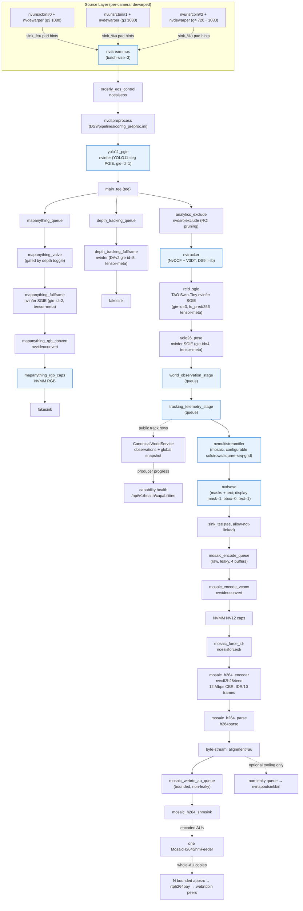

# DS9.1 Pipeline Graph (Noesis)

This document maps the **DS9 pipeline** as built and run via:

- Entry: `DS9/noesis/ds9_runtime.py` (sets DS9-specific env + delegates to the DS9 runtime core)
- Runtime core: `DS9/noesis/ds9_runtime_core.py`
- Builder: `DS9/noesis/pipelines/ds8_pipeline.py` (Service Maker graph construction; module name is still historical)
- Hooks & metadata: `DS9/noesis/pipelines/hooks.py`
- Config: `DS9/config/infer.yaml` (canonical) or
  `DS9/config/infer_v3dt.yaml` (SV3DT profile)

The active SDK target is DeepStream 9.1 at
`/opt/nvidia/deepstream/deepstream-9.1`. All heavy inference, tracking, tiling,
and OSD remain on GPU (NVMM). CPU is touched only at the edges for telemetry
publishing, calibration, and optional native metadata bridges.

## High-Level Flow

## Detailed Component Map (DS9 Config)

| Layer                  | Component(s)                          | Element(s)                  | Role / Notes (DS9) |
|------------------------|---------------------------------------|-----------------------------|--------------------|
| **Ingestion**         | source_0/1/2 + dewarper_*             | nvurisrcbin + nvdewarper + nvvideoconvert + capsfilter | 3 live RTSP cams. Dewarper configs under DS9/config/. Per-source nvbuf handling for zero-copy. |
| **Batching**          | streammux                             | nvstreammux                 | batch-size=3, 1920x1080, gpu-id=0, nvbuf-memory-type=0, enable-padding=1. |
| **Shutdown control**  | orderly_eos_control                   | noesiseos                   | First stage after streammux, before preprocess/PGIE. Injects acknowledged downstream EOS so Service Maker `wait()` can finish before callback-owned resources close. |
| **Preprocess**        | preprocess                            | nvdspreprocess              | DS9/pipelines/config_preproc.ini (letterbox etc. for PGIE). |
| **Primary Inference** | yolo11_pgie                           | nvinfer                     | YOLO11-seg (custom fused engine under DS9/models/engines). gie-id=1. Segmentation masks enabled. |
| **Branch Point**      | main_tee                              | tee                         | Splits to tracker path + full-frame depth SGIEs (MapAnything + DAv2). |
| **ROI Pruning**       | analytics_exclude                     | nvdsroiexclude (custom)     | Pre-tracker ROI exclusion (DS9/build + gst-plugins copy of plugin). |
| **Tracking**          | tracker                               | nvtracker                   | NvDCF/SV3DT (DS9-specific ll-lib under `/opt/nvidia/deepstream/deepstream-9.1/lib`). |
| **ReID SGIE**         | reid_sgie                             | nvinfer                     | NVIDIA TAO Swin-Tiny (gie-id=3), dynamic batch 1..16, raw `fc_pred` 256-d tensor metadata for identity. No custom parser. |
| **Pose SGIE**         | yolo26_pose                           | nvinfer                     | YOLO26-n pose (gie-id=4). Keypoints + features via tensor meta + native DS9 bridge. |
| **Depth SGIE 1 (baseline)** | depth_tracking_fullframe         | nvinfer                     | Depth-Anything-V2 metric (gie-id=5). Full-frame. Tensor meta consumed by object-depth fusion hook. Gated? No (always on in current config). |
| **Depth SGIE 2 (rich)** | mapanything_fullframe             | nvinfer                     | MapAnything (gie-id=2). Full-frame. **Valve-gated** (mapanything_valve + DepthGateOperator / valve drop). Tensors are intersected with the calibrated per-camera dewarper-validity mask before depth storage + BEV + WS. |
| **DS9 World Stage**   | world_observation_stage               | queue                       | **Critical DS9 hook point**. Pose feature attachment + object depth fusion (world coords via calibration). Native DS9 pose meta ext used here. |
| **Telemetry Stage**   | tracking_telemetry_stage              | queue                       | Analytics telemetry → public track rows with explicit timing/identity evidence → versioned observations, global world snapshot, WS payloads, and capability progress. |
| **Analytics**         | analytics                             | nvdsanalytics               | Post-tracker (config_nvdsanalytics_post.ini + nvdsanalytics.yaml stages). |
| **Mosaic**            | tiler                                 | nvmultistreamtiler          | 3-source mosaic. Supports square-seq-grid or explicit cols/rows. Sized to preserve tile aspect. |
| **Overlays**          | osd                                   | nvdsosd                     | GPU masks + text. BBoxes off by default. Display meta (keypoints, trails) injected upstream. |
| **Output Tee**        | sink_tee                              | tee (allow-not-linked)      | Feeds the encoded mosaic branch; configured `mosaic_sink`/`bev_sink` entries are semantic placeholders. |
| **Mosaic H.264 / WebRTC** | mosaic_encode_queue + mosaic_encode_vconv + mosaic_encoder_caps + mosaic_force_idr + mosaic_h264_encoder + mosaic_h264_parse + mosaic_h264_au_caps + mosaic_webrtc_au_queue + mosaic_h264_shmsink | queue + nvvideoconvert + capsfilter + noesisforceidr + nvv4l2h264enc + h264parse + capsfilter + queue + shmsink | One GPU encode at 12 Mbps CBR and one IDR per 10 frames. The raw four-buffer queue is leaky; compressed queues are bounded and non-leaky. One external SHM feeder fans complete AUs to per-peer appsrc/payloader/webrtcbin pipelines. |
| **Optional RTSP tooling** | mosaic_h264_tee + mosaic_rtsp_out_queue + rtsp_out | tee + queue + nvrtspoutsinkbin | Disabled by default. Uses the already encoded AUs and is never WebRTC ingress. |

## V3DT Profile Delta

`--tracking-mode v3dt` selects `DS9/config/infer_v3dt.yaml` and
`DS9/config/cameras_v3dt.yaml`. The graph stays GPU-first, but the profile:

- pins streammux to unpadded `1920x1080`, one surface per frame, matching the
  locked camInfo projection space;
- replaces the NvDCF low-level config with the DS9-owned SV3DT config and
  materializes its camera, BodyPose3DNet, and internal ReID paths absolutely;
- disables the baseline DAv2 lane because SV3DT owns the 3D observation, while
  retaining gated MapAnything for explicit depth/reconstruction requests; and
- preserves `bbox3d`/`velocity3d` as tracker-tuple diagnostics, converts the
  bbox ground endpoint through the locked `xzy` map, and publishes only Y-up
  `backend_world_m` to the canonical world service. Missing axis/bbox state
  fails closed. This is SV3DT. MV3DT is separate and disabled: only
  Kitchen/Family Room is a future candidate edge, Living Room has no edge, and
  corrected Kitchen geometry plus synchronized occupied overlap evidence is
  required before activation. AMC is deferred.

Large V3DT model and engine bytes live under `NOESIS_DS9_ARTIFACT_ROOT`. The
virtual `DS9/models/...` paths remain stable in reviewed configs and are mapped
to that physical root during staging, preflight, and runtime materialization.

## Metadata & Hook Attachment Points (the "DS9" Layer)

These are **not** new GStreamer elements but Python `BufferOperator` or
`BatchMetadataOperator` probes attached through pyservicemaker. They implement
exact MapAnything capture, the advanced world model, overlays, and telemetry.

| Hook Function                        | Attach Target                  | What It Does (DS9) |
|--------------------------------------|--------------------------------|--------------------|
| `attach_intrinsics_hook`            | streammux                     | Per-frame camera intrinsics (from calibration bundle) into frame/user meta. |
| `attach_mapanything_postprocess_hook` | mapanything_rgb_caps (post-inference NVMM RGB caps) | A Service Maker `BufferOperator` reads the preserved UID 2 `depth/conf/mask` metadata and extracts the exact RGB batch surface from the same post-conversion buffer. It applies no second batch offset, bounds/times the metadata-lifetime copies, then hands owned arrays to a runtime-owned bounded worker for alignment/storage → `DepthStorageManager` + RPC providers for BEV / WS; shutdown drains and joins that worker before store teardown. |
| `attach_pose_feature_hook`          | world_observation_stage       | Read YOLO26 pose tensor meta → compact `NOESIS.POSE_FEATURES` user meta via **DS9 native extension** (`noesis_pose_meta_ext`). Also maintains bounded pose cache. |
| `attach_object_depth_fusion_hook`   | world_observation_stage       | Fuse DAv2 per-object depth + pose keypoints + calibration → world (x,y,z) + footpoint + height. Populates `NOESIS.OBJECT_DEPTH` etc. |
| `attach_analytics_telemetry_hook`   | tracking_telemetry_stage (or analytics) | nvdsanalytics events → time/identity-complete public rows → canonical observations/world snapshot, boundary/occupancy metrics, WS broadcast, and capability health. |
| `attach_trail_overlay_hook`         | tiler (preferred) / osd       | Injects `NvDsDisplayMeta` trails (floor-plane gravity, stable_id coloring, configurable window/smoothing). |
| `attach_pose_keypoint_overlay_hook` | tiler (preferred) / osd       | Draws 2D skeletons/keypoints from pose features into display meta (before nvdsosd renders). |
| `attach_osd_label_hook`             | tiler / osd                   | Enhances object labels (adds stable ID, depth z=xxm, conf). |
| `attach_exclude_prune_hook` + reload bridge | analytics_exclude / analytics | Dynamic ROI reload + pruning of excluded objects pre-tracker. |
| (ReID side)                         | reid_sgie `fc_pred` tensor meta (inside hooks) | Identity consumes normalized 256-d embeddings. |

Native DS9 extensions live in `DS9/native_extensions/` (built against DS9 headers):
- `noesis_pose_meta_ext.so`
- `noesis_depth_meta_ext.so`
- `noesis_depth_tracking_tensor_ext.so`
- `noesis_reid_meta_ext.so`
- `noesis_v3dt_meta_ext.so`
- `noesis_analytics_meta_ext.so`
- `noesis_latency_ext.so`

These provide zero-copy-ish or safe Service Maker + DS9 batch meta allocation paths (avoiding the unsafe pyds paths that were problematic on DS9).

The 2026-07-25 isolated canonical-container validation passed this exact
post-inference capture path for all three configured cameras: each fresh manual
capture carried a same-buffer `1920x1080` `rgb8` surface, and the subsequent
cache-only checks caused zero snapshot mutation. That proves the attachment and
fresh/cache-only contracts; it is neither production promotion nor an
absolute-depth-accuracy result.

## Gating & Runtime Controls (DS9 Specific)

- **MapAnything depth branch** is heavily gated:
  - `valve` element + `DepthGateOperator` (BufferOperator probe) + `mark_depth_enabled()` / `enable_depth(seconds)`.
  - Starts closed; briefly primed at activate() for caps negotiation, then closed unless a burst is requested.
  - Controlled via WS/REST and `NOESIS_MAPANYTHING_*` envs.
- Every valve that can be closed uses `drop-mode` 1 or 2 so sticky events,
  including orderly shutdown EOS, still propagate.
- Depth tracking (DAv2) runs continuously (not valve-gated in current config).
- `NOESIS_MOSAIC_WEBRTC_ENABLED=1` builds the encoded H.264 SHM output and gateways; it does not enable RTSP.
- `NOESIS_MOSAIC_RTSP_ENABLED=1` independently adds the optional codec-bypass tooling branch.

## Output Surfaces

- **Mosaic WebRTC**: tiled + OSD + trails + keypoints + masks from the H.264 SHM AU bridge. This is the primary live view.
- **Optional Mosaic RTSP** (`rtsp://.../mosaic`): explicit tooling output only.
- **Configured sink placeholders**: `mosaic_sink` and `bev_sink` remain semantic
  config entries and are not materialized as competing tee branches.
- **WebSocket telemetry**: Rich per-track world observations, ReID stable IDs, depth values, occupancy, boundary metrics.
- **REST APIs**: ReID aliasing, analytics config, depth queries, etc. (see DS9 server modules).

## How DS9 Differs From Baseline DS8 Graph

- Explicit `world_observation_stage` + `tracking_telemetry_stage` queues as dedicated hook attachment points.
- Two full-frame depth SGIEs (baseline DAv2 + MapAnything) branched early at `main_tee`.
- Valve + operator gating on the expensive MapAnything branch.
- Heavy use of native extensions for pose / depth / ReID metadata (Service Maker safe).
- Per-source dewarper chains (3 specific dewarper txts) + nvstreammux (not nvmultiurisrcbin) because of dewarpers.
- Tiler layout tuned for 3:1-ish (or square-seq-grid).
- H.264 SHM → WebRTC is the primary visualization output; optional RTSP is not part of browser delivery.

## Files to Inspect for the Live Graph

- `DS9/config/infer.yaml` — the declarative spec (models, sources, sinks, visualization).
- `DS9/noesis/pipelines/ds8_pipeline.py:build_pipeline()` — the code that materializes Components + links.
- `DS9/noesis/pipelines/hooks.py` — all attach_* functions and the processors (pose, depth fusion, overlays, telemetry).
- `DS9/noesis/ds9_runtime.py` — sets the DS9.1 environment, runs preflight, and
  delegates to `DS9/noesis/ds9_runtime_core.py`.
- Runtime wiring in `DS9/noesis/ds9_runtime_core.py` (around the post-build hook attachment block).

For validation, see `DS9/scripts/*_smoke_test.py`, `DS9/docs/validation_runbook.md`, and the broader regression gates in `DS9/DS9_REBUILD_AND_SMOKE_GATES.md`.

---

**Last updated**: 2026-08-12 (DeepStream 9.1 target and deferred MV3DT/AMC boundary).
