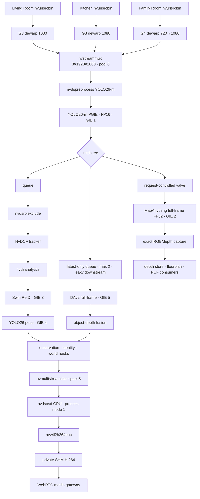

# Canonical DeepStream 9.1 pipeline graph

Status: native baseline, 2026-08-23. Source of truth:
`DS9/config/infer.yaml` plus `DS9/noesis/pipelines/`.

## Video graph

## Publication flow

```mermaid
flowchart LR
    FRAME[Processed frame] --> OBS[Canonical observations]
    OBS --> COMMIT[World transaction commit]
    COMMIT --> TRACKING[tracking message]
    TRACKING --> SNAPSHOT[world snapshot/events]
    SNAPSHOT --> BEV[paired BEV frame]
    BEV --> WS[Authenticated WebSocket]
    WS --> MENON[Menon gateway]
    MENON --> DASH[oai2-fe dashboard]
```

Tracking/world authority is committed before BEV release. PCF provides the
floorplan/reconstruction presentation, while the paired live tracking cohort
provides dots and trails. PCF does not synthesize people.

## Source and batching contract

- Three `nvurisrcbin` sources with GPU decode and audio disabled.
- Living Room/Kitchen use the G3 1080 dewarper; Family Room uses the G4
  720-to-1080 dewarper.
- Calibrated validity masks exclude pixels outside the fisheye image circle.
- `nvstreammux`: batch 3, 1920×1080, live source, 40,000 µs timeout, NVMM.
- `nvstreammux` and `nvmultistreamtiler` each use an explicit eight-surface
  pool; GPU OSD is `process-mode=1` on the installed DS9.1 stack.
- The authoritative tracking/OSD/encode path is lossless within its declared
  pipeline contract. The secondary DAv2 branch uses a two-buffer
  downstream-leaky latest-only queue so it cannot back-pressure that path.
- MapAnything remains closed outside startup negotiation or an admitted manual
  capture. Its branch queue does not grant it live tracking authority.

## Hot-path contract

- Full video surfaces remain in NVMM/GPU memory through OSD and encode.
- DAv2 alignment/readiness uses pooled private CUDA resources and query-only
  completion; compact per-person readbacks use reusable pinned host buffers.
- Optional depth/evidence/persistence work bounds its own queue and freshness.
  Canonical tracking/world/BEV publication remains exact, ordered, and
  revision-bound rather than latest-only.
- Models, resolution, and inference cadence are part of the accepted baseline.
  See [`../docs/performance_invariants.md`](../docs/performance_invariants.md)
  before changing the graph or callback path.

## Inference roles

| GIE | Model | Cadence/role |
| ---: | --- | --- |
| 1 | YOLO26-m | Primary person detection, every selected frame |
| 3 | Swin Tiny ReID | Person embeddings for StableID |
| 4 | YOLO26-n pose | Pose/keypoint features |
| 5 | DepthAnythingV2 metric | Always-on tracking/object depth |
| 2 | MapAnything FP32 | Full-frame depth only while an admitted manual capture owns the valve |

## Outputs

- WebSocket/telemetry and WebRTC signaling: loopback 6008.
- REST: loopback 8080.
- H.264: one 3840×720 short-GOP encode, private SHM → WebRTC.
- RTSP: disabled, even though inactive config keys remain for compatibility.
- BEV: JSON/metadata only, `camera_local_ground_m`, no JPEG branch.

## Disabled paths

- MV3DT/AMC: geometry-gated and disabled.
- Alternate detectors, segmentation, Wholebody49, RF-DETR, and DA3Metric are
  research/manual profiles, not the baseline graph unless explicitly selected
  for a scoped experiment.
- DS8/9.0 and Docker have no place in this graph.
