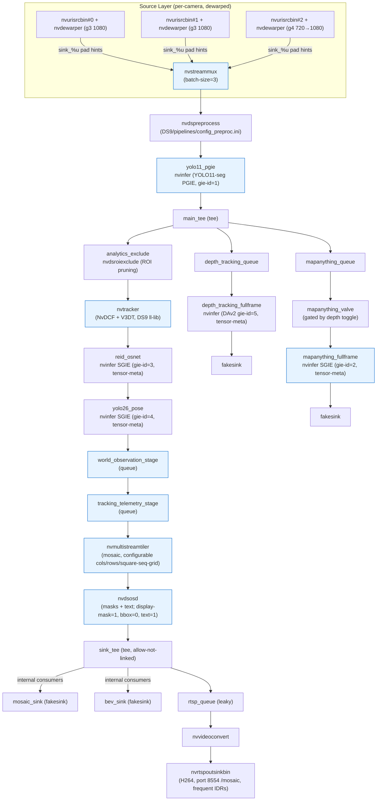

# DS9 Pipeline Graph (Noesis)

This document maps the **DS9 pipeline** as built and run via:

- Entry: `DS9/noesis/ds9_runtime.py` (sets DS9-specific env + delegates to the DS9 runtime core)
- Runtime core: `DS9/noesis/ds9_runtime_core.py`
- Builder: `DS9/noesis/pipelines/ds8_pipeline.py` (Service Maker graph construction; module name is still historical)
- Hooks & metadata: `DS9/noesis/pipelines/hooks.py`
- Config: `DS9/config/infer.yaml` (3 dewarped RTSP sources, multiple full-frame SGIEs, RTSP+WebRTC mosaic)

All heavy inference, tracking, tiling, and OSD remain on GPU (NVMM). CPU is touched only at the edges for telemetry publishing, calibration, and optional native metadata bridges.

## High-Level Flow

## Detailed Component Map (DS9 Config)

| Layer                  | Component(s)                          | Element(s)                  | Role / Notes (DS9) |
|------------------------|---------------------------------------|-----------------------------|--------------------|
| **Ingestion**         | source_0/1/2 + dewarper_*             | nvurisrcbin + nvdewarper + nvvideoconvert + capsfilter | 3 live RTSP cams. Dewarper configs under DS9/config/. Per-source nvbuf handling for zero-copy. |
| **Batching**          | streammux                             | nvstreammux                 | batch-size=3, 1920x1080, gpu-id=0, nvbuf-memory-type=0, enable-padding=1. |
| **Preprocess**        | preprocess                            | nvdspreprocess              | DS9/pipelines/config_preproc.ini (letterbox etc. for PGIE). |
| **Primary Inference** | yolo11_pgie                           | nvinfer                     | YOLO11-seg (custom fused engine under DS9/models/engines). gie-id=1. Segmentation masks enabled. |
| **Branch Point**      | main_tee                              | tee                         | Splits to tracker path + full-frame depth SGIEs (MapAnything + DAv2). |
| **ROI Pruning**       | analytics_exclude                     | nvdsroiexclude (custom)     | Pre-tracker ROI exclusion (DS9/build + gst-plugins copy of plugin). |
| **Tracking**          | tracker                               | nvtracker                   | NvDCF (DS9-specific ll-lib under /opt/.../deepstream-9.0). |
| **ReID SGIE**         | reid_osnet                            | nvinfer                     | OSNet IBN (gie-id=3). Tensor meta for StableID. Dynamic batch. |
| **Pose SGIE**         | yolo26_pose                           | nvinfer                     | YOLO26-n pose (gie-id=4). Keypoints + features via tensor meta + native DS9 bridge. |
| **Depth SGIE 1 (baseline)** | depth_tracking_fullframe         | nvinfer                     | Depth-Anything-V2 metric (gie-id=5). Full-frame. Tensor meta consumed by object-depth fusion hook. Gated? No (always on in current config). |
| **Depth SGIE 2 (rich)** | mapanything_fullframe             | nvinfer                     | MapAnything (gie-id=2). Full-frame. **Valve-gated** (mapanything_valve + DepthGateOperator / valve drop). Tensors → depth storage + BEV + WS. |
| **DS9 World Stage**   | world_observation_stage               | queue                       | **Critical DS9 hook point**. Pose feature attachment + object depth fusion (world coords via calibration). Native DS9 pose meta ext used here. |
| **Telemetry Stage**   | tracking_telemetry_stage              | queue                       | Analytics telemetry (nvdsanalytics frame/object events → WS payloads + boundary metrics). |
| **Analytics**         | analytics                             | nvdsanalytics               | Post-tracker (config_nvdsanalytics_post.ini + nvdsanalytics.yaml stages). |
| **Mosaic**            | tiler                                 | nvmultistreamtiler          | 3-source mosaic. Supports square-seq-grid or explicit cols/rows. Sized to preserve tile aspect. |
| **Overlays**          | osd                                   | nvdsosd                     | GPU masks + text. BBoxes off by default. Display meta (keypoints, trails) injected upstream. |
| **Output Tee**        | sink_tee                              | tee (allow-not-linked)      | Distributes to internal fakesinks + RTSP branch. |
| **Mosaic RTSP**       | rtsp_queue + rtsp_vconv + rtsp_out    | queue + nvvideoconvert + nvrtspoutsinkbin | H.264 RTSP @ 8554/mosaic. Tuned IDR/iframe for fast WebRTC start. WebRTC gateway consumes this. |

## Metadata & Hook Attachment Points (the "DS9" Layer)

These are **not** new GStreamer elements but Python `BatchMetadataOperator` / `Probe` attachments via pyservicemaker. They implement the advanced world model, overlays, and telemetry.

| Hook Function                        | Attach Target                  | What It Does (DS9) |
|--------------------------------------|--------------------------------|--------------------|
| `attach_intrinsics_hook`            | streammux                     | Per-frame camera intrinsics (from calibration bundle) into frame/user meta. |
| `attach_mapanything_postprocess_hook` | mapanything_fullframe (nvinfer) | Decode SGIE tensor meta (depth/conf/mask/planes) → `DepthStorageManager` + RPC providers for BEV / WS. |
| `attach_pose_feature_hook`          | world_observation_stage       | Read YOLO26 pose tensor meta → compact `NOESIS.POSE_FEATURES` user meta via **DS9 native extension** (`noesis_pose_meta_ext`). Also maintains bounded pose cache. |
| `attach_object_depth_fusion_hook`   | world_observation_stage       | Fuse DAv2 per-object depth + pose keypoints + calibration → world (x,y,z) + footpoint + height. Populates `NOESIS.OBJECT_DEPTH` etc. |
| `attach_analytics_telemetry_hook`   | tracking_telemetry_stage (or analytics) | nvdsanalytics events → structured tracking payloads, boundary/occupancy metrics, WS broadcast. |
| `attach_trail_overlay_hook`         | tiler (preferred) / osd       | Injects `NvDsDisplayMeta` trails (floor-plane gravity, stable_id coloring, configurable window/smoothing). |
| `attach_pose_keypoint_overlay_hook` | tiler (preferred) / osd       | Draws 2D skeletons/keypoints from pose features into display meta (before nvdsosd renders). |
| `attach_osd_label_hook`             | tiler / osd                   | Enhances object labels (adds stable ID, depth z=xxm, conf). |
| `attach_exclude_prune_hook` + reload bridge | analytics_exclude / analytics | Dynamic ROI reload + pruning of excluded objects pre-tracker. |
| (ReID side)                         | reid_osnet tensor meta (inside hooks) | `StableIDManager` updates from embeddings. |

Native DS9 extensions live in `DS9/native_extensions/` (built against DS9 headers):
- `noesis_pose_meta_ext.so`
- `noesis_depth_meta_ext.so`
- `noesis_depth_tracking_tensor_ext.so`
- `noesis_reid_meta_ext.so`
- `noesis_v3dt_meta_ext.so`
- `noesis_latency_ext.so`

These provide zero-copy-ish or safe Service Maker + DS9 batch meta allocation paths (avoiding the unsafe pyds paths that were problematic on DS9).

## Gating & Runtime Controls (DS9 Specific)

- **MapAnything depth branch** is heavily gated:
  - `valve` element + `DepthGateOperator` (BufferOperator probe) + `mark_depth_enabled()` / `enable_depth(seconds)`.
  - Starts closed; briefly primed at activate() for caps negotiation, then closed unless a burst is requested.
  - Controlled via WS/REST and `NOESIS_MAPANYTHING_*` envs.
- Depth tracking (DAv2) runs continuously (not valve-gated in current config).
- `NOESIS_MOSAIC_WEBRTC_ENABLED=1` (default in ds9_runtime) forces RTSP output.

## Output Surfaces

- **Mosaic RTSP** (`rtsp://.../mosaic`): tiled + OSD + trails + keypoints + masks. Primary live view + WebRTC source.
- **Internal fakesinks**: Consumed by:
  - Flow retrievers / frame servers (if enabled)
  - BEV renderer (world-frame top-down)
  - Any appsink probes for diagnostics
- **WebSocket telemetry**: Rich per-track world observations, ReID stable IDs, depth values, occupancy, boundary metrics.
- **REST APIs**: ReID aliasing, analytics config, depth queries, etc. (see DS9 server modules).

## How DS9 Differs From Baseline DS8 Graph

- Explicit `world_observation_stage` + `tracking_telemetry_stage` queues as dedicated hook attachment points.
- Two full-frame depth SGIEs (baseline DAv2 + MapAnything) branched early at `main_tee`.
- Valve + operator gating on the expensive MapAnything branch.
- Heavy use of native extensions for pose / depth / ReID metadata (Service Maker safe).
- Per-source dewarper chains (3 specific dewarper txts) + nvstreammux (not nvmultiurisrcbin) because of dewarpers.
- Tiler layout tuned for 3:1-ish (or square-seq-grid).
- RTSP + WebRTC is the primary visualization output (mosaic_sink fakesink is mostly a placeholder).

## Files to Inspect for the Live Graph

- `DS9/config/infer.yaml` — the declarative spec (models, sources, sinks, visualization).
- `noesis/pipelines/ds8_pipeline.py:build_pipeline()` — the code that materializes Components + links.
- `noesis/pipelines/hooks.py` — all attach_* functions and the processors (pose, depth fusion, overlays, telemetry).
- `DS9/noesis/ds9_runtime.py` — only sets env + preflight then calls shared `noesis.ds8_runtime`.
- Runtime wiring in `DS9/noesis/ds9_runtime_core.py` (around the post-build hook attachment block).

For validation, see `DS9/scripts/*_smoke_test.py`, `DS9/docs/validation_runbook.md`, and the broader regression gates in `DS9/DS9_REBUILD_AND_SMOKE_GATES.md`.

---

**Last updated**: 2026-06-15 (current DS9 pipeline builder + DS9/config/infer.yaml + hook attachments).
