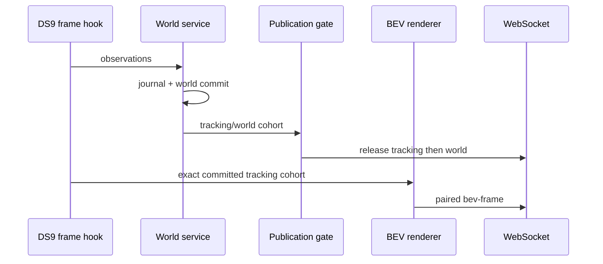

# BEV and capture-event integration

Status: active native DS9.1 contract, including PCF tracking pairing,
2026-08-15.

## Shared ownership

- `noesis/telemetry/bev.py`: sole BEV renderer.
- `noesis_core/capture_event_fusion.py`: typed raw-cohort admission and exact
  fusion identity.
- `noesis/depth_capture_event.py`: transactional storage adapter.
- `noesis/capture_event_controller.py`: one process-wide depth/floorplan
  capture owner and MapAnything valve lease.
- `noesis_core/active_floorplan.py`: bounded per-camera floorplan authority.
- `noesis_core/tracking_continuity.py`: paired tracking/BEV cadence.
- `DS9/noesis/pipelines/hooks.py`: DS9.1 metadata and publication adapter.

DS9 must not create a private BEV fork, open another camera reader, use stale
data after an exact-capture failure, or synthesize tracking from static scene
evidence.

## Capture transaction

One non-cache request takes a per-camera lease and the one process-wide
MapAnything lease, then:

1. Proves the valve closed, worker idle, and storage frontier clean.
2. Records the camera's raw baseline.
3. Opens one bounded depth burst, closes it, and repeats the idle/frontier
   barriers.
4. Selects only newer same-camera typed raw snapshots.
5. Fuses and commits one `capture_event_fused`/`intra_capture` result.
6. Reloads and revalidates exact reference, write ID, timestamp, digest,
   sequence, role, fusion level, event ID, and source IDs before response.

Same-camera and cross-camera contention return `capture_event_busy`. Any gate,
idle, frontier, cohort, or identity mismatch fails closed. No `latest` lookup
may replace an exact requested result.

Cache-only requests resolve before admission and either return an already-valid
entry or `no_cached_depth`/`no_cached_floorplan`. They do not open the valve,
read a camera, fuse, write, or mutate active authority.

## PCF and active floorplans

Only a valid, bounded, calibration-bound
`camera_local_ground_m`/meters floorplan becomes active. For cameras with an
admitted immutable Scene Prior, `scene_prior_only` PCF is the canonical
dashboard presentation.

PCF separates:

- full measured reconstruction extent;
- authored semantic room footprint;
- diagnostic layers and surface color;
- live tracking/world authority.

The static PCF revision supplies geometry and raster bounds. It does not create
people. Each emitted PCF `bev-frame` carries the exact committed tracking cohort
for that camera, which supplies footpoints, dots, and trails. Empty committed
occupancy is a valid frame with no dots.

## Tracking/world/BEV ordering

The effective cadence is the maximum of selected tracking cadence and BEV
cadence. Lifecycle/key/count changes force a pair.

A tracking failure suppresses BEV. A pre-admission BEV failure leaves authority
retryable; a post-admission authority failure is fatal. Sender admission is not
a client delivery acknowledgement.

## Frames and depth

- Canonical world: `backend_world_m`.
- Inline BEV/PCF: `camera_local_ground_m`.
- Projection happens only at the BEV boundary using accepted calibration and
  active floorplan authority.
- Registered DAv2 depth is usable only when status, registration, finite
  positive depth, and tolerance checks all pass.

Calibration changes invalidate the affected active floorplan/cache rather than
reusing old geometry.

## Health

Runtime stats expose:

- `pipeline.bev` with configured/active/failed cameras and floorplan authority;
- `pipeline.active_floorplan` with exact per-camera snapshot/calibration
  identity;
- `pipeline.capture_event_fusion` with process-gate and failure state.

`active_ready` means an exact frame was published, even when empty.
`inactive_ready` means no successful exact frame yet. Missing authority after
readiness or an actual renderer/publication failure is not healthy.

## Focused validation

Choose only tests that cover the changed layer. For a presentation/publication
change, prove:

1. backend tracking/world/BEV contract tests;
2. frontend PCF parser/render tests;
3. one short live dashboard or WebSocket capture where a present person creates
   dots/trails and an empty camera remains valid.

For capture/storage changes, issue one exact fresh request plus one cache-only
read and verify the cache-only operation does not mutate capture or floorplan
authority. Do not run the historical promotion gate unless explicitly required.
