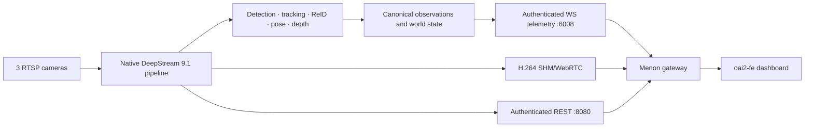

# Noesis

Noesis is a native-host, three-camera spatial-perception application built on
NVIDIA DeepStream 9.1. It detects and tracks people, maintains household
identity and canonical world state, estimates object and scene depth, publishes
telemetry, and feeds the Menon/oai2-fe dashboard.

## Current runtime

- DeepStream 9.1.0, CUDA 13.2, TensorRT 10.16.0.72, GStreamer 1.24.2.
- Native Python 3.12 environment; Docker is not part of the canonical runtime
  or build path.
- Three live `nvurisrcbin` sources: Living Room, Kitchen, and Family Room.
- YOLO26-m detector, NvDCF tracker, Swin ReID, YOLO26 pose, always-on
  DepthAnythingV2 object-depth, and gated MapAnything full-frame depth.
- One GPU H.264 mosaic delivered through SHM/WebRTC. RTSP output is disabled.
- REST is loopback-only on 8080 and WebSocket/WebRTC signaling is loopback-only
  on 6008; Menon owns browser-facing authentication and delivery.
- Baseline tracking is canonical. MV3DT and AMC are disabled pending accepted
  Kitchen geometry and Kitchen/Family Room overlap evidence.

DeepStream 8, DeepStream 9.0, and the former DS9.1 container deployment are
historical. They are not supported runtime alternatives. Their remaining inert
entrypoints/packages are tracked for destructive removal in
[`plans/ds91_native_host_only_migration.md`](plans/ds91_native_host_only_migration.md).

## Architecture at a glance



The detailed graph and authority boundaries are in
[`DS9/PIPELINE_GRAPH.md`](DS9/PIPELINE_GRAPH.md) and
[`docs/CODEBASE_DESCRIPTION.md`](docs/CODEBASE_DESCRIPTION.md).

## Repository map

| Path | Purpose |
| --- | --- |
| `DS9/` | Canonical DeepStream 9.1 adapter, configs, native sources, parsers, scripts, and tests |
| `noesis/` | Shared application services, telemetry, metadata, identity, depth, and world logic |
| `noesis_core/` | SDK-neutral contracts, state, scene, validation, and lifecycle primitives |
| `config/` | Shared camera, analytics, calibration, and world-policy configuration |
| `oai2-fe/` | Noesis diagnostics/dashboard frontend delivered through Menon |
| `docs/` | Current architecture, contracts, operating guidance, and history index |
| `plans/` | Active work orders; completed/superseded plans are under `plans/archive/` |

## Operating the installed application

The user service owns the canonical runtime. Use the existing service rather
than starting a second process:

```bash
systemctl --user status noesis-appliance.service
systemctl --user restart noesis-appliance.service
```

The native supervisor validates the host, virtual environment, secrets, model
realization, and pipeline config before opening cameras:

```bash
NATIVE_ENV_FILE="$(
  systemctl --user show noesis-appliance.service \
    -p EnvironmentFiles --value --no-pager |
    awk '$1 ~ /\/native\.env$/ { print $1; exit }'
)"
test -n "$NATIVE_ENV_FILE" && test -f "$NATIVE_ENV_FILE"
set -a
. "$NATIVE_ENV_FILE"
set +a

"${NOESIS_DS91_NATIVE_ROOT}/venv/bin/python" \
  DS9/scripts/run_canonical_runtime_host.py check
```

Do not run the supervisor's `run` mode beside systemd; ports 6008 and 8080 are
single-owner resources.

## Development and validation

Start with the relevant NVIDIA skill routed by
[`DS9/docs/deepstream_9_1_agent_skills.md`](DS9/docs/deepstream_9_1_agent_skills.md).
Then use the smallest focused checks for the changed component and one direct
live or recorded smoke when the application path is affected. Do not stage an
appliance release or create candidate/selector ceremony for normal work.

See [`docs/testing_guide.md`](docs/testing_guide.md) for practical commands.

## Documentation

- [`docs/README.md`](docs/README.md): current documentation index.
- [`docs/runtime_baseline.md`](docs/runtime_baseline.md): exact runtime and
  performance baseline.
- [`docs/api_contracts_ws.md`](docs/api_contracts_ws.md),
  [`docs/api_contracts_rest.md`](docs/api_contracts_rest.md), and
  [`docs/metadata_contracts.md`](docs/metadata_contracts.md): public/internal
  application contracts.
- [`docs/architecture_decisions.md`](docs/architecture_decisions.md): current
  decisions and rationale.
- [`docs/upgrade_history.md`](docs/upgrade_history.md): dated upgrade record.
- [`docs/history/README.md`](docs/history/README.md): historical archive map.
