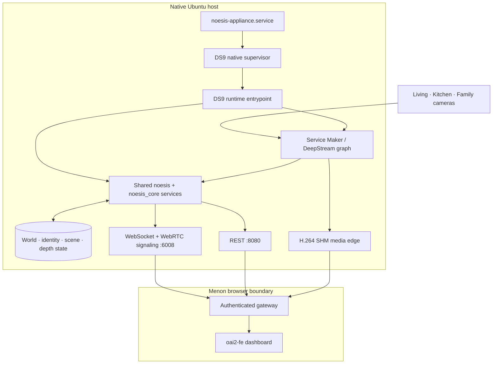
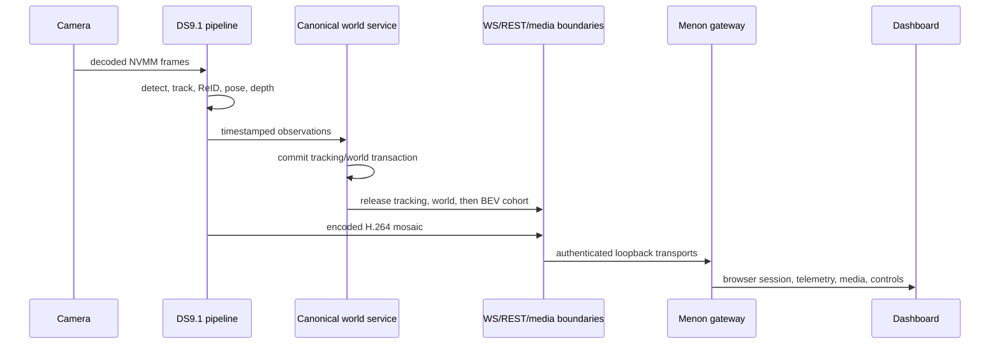

# Codebase description

Status: native DeepStream 9.1 architecture, 2026-08-26.

## Runtime ownership

Noesis has one supported perception runtime. The launcher
`DS9/noesis/ds9_runtime.py` establishes DS9.1 import and artifact authority,
then invokes `DS9/noesis/ds9_runtime_core.py`. The core assembles the pipeline,
shared product services, WebSocket/REST boundaries, identity, world state,
depth storage, and shutdown lifecycle.

`noesis/` and `noesis_core/` are shared application libraries. They are not a
second DeepStream runtime. The executable pipeline is
`DS9/noesis/pipelines/deepstream_pipeline.py`; the containing DS9 tree and
launcher establish its active authority.

## Component map

## Source ownership

| Area | Owner paths | Notes |
| --- | --- | --- |
| Runtime startup | `DS9/noesis/ds9_runtime.py`, `DS9/scripts/run_canonical_runtime_host.py` | Native-only platform, venv, secret, artifact, and port checks |
| Pipeline graph | `DS9/noesis/pipelines/`, `DS9/config/infer.yaml`, `DS9/pipelines/` | Service Maker graph and inference configs |
| Native metadata | `DS9/native/`, `DS9/gst-plugins/`, `DS9/csrc/` | DS9.1/CUDA 13.2 build authority |
| Runtime APIs | `noesis/server/` | Shared REST contracts and product services |
| Telemetry/world | `noesis/telemetry/`, `noesis_core/`, `DS9/noesis/telemetry/` | Transactional tracking/world and BEV publication |
| Identity | `reid/`, `noesis/identity_v2_service.py`, `noesis/server/reid_api.py` | Stable IDs and resident/visitor policy |
| Depth/reconstruction | `geometry/`, `noesis/calibration/`, `tools/mapanything_phone_scan/` | DAv2, MapAnything, registration, Scene Prior, offline reconstruction |
| Dashboard | `oai2-fe/` | Noesis diagnostic UI; Menon owns browser-facing serving/auth |
| Contracts | `contracts/`, `docs/api_contracts_*.md`, `docs/metadata_contracts.md` | JSON schema, TypeScript, and narrative contracts |

## Authority flow

Publication lifecycle is deliberate: the runtime closes and drains the shared
publication gate before stopping WebSocket egress so no admitted callback races
the transport shutdown.

## Legacy boundary

DS8, DS9.0, and container deployment implementations have been retired from
the active tree. Their non-normative records are indexed by
`docs/history/README.md` and `plans/archive/README.md`; current work must never
depend on them.
