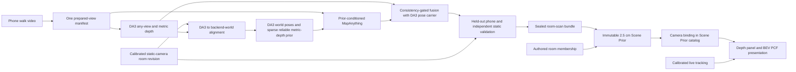

# Prior-Conditioned Fusion (PCF) workflow

Status: canonical room-reconstruction and Scene Prior handoff runbook,
2026-08-16.

Use this document when someone asks to **run PCF**, **reconstruct another room
with PCF**, or **publish a PCF room to Noesis**. It is the single end-to-end
entry point. The phone utility reference and fusion decision record linked at
the end provide implementation detail, but they do not replace this sequence.

## What PCF means

**PCF** means **Prior-Conditioned Fusion**. In Noesis, that name refers to this
specific selected reconstruction method:

1. run DA3 on one fixed set of prepared phone views;
2. align the DA3 trajectory to the calibrated static-camera room world;
3. give MapAnything the DA3 world poses and a sparse, reliability-gated subset
   of DA3 metric depth as priors;
4. consistency-gate the conditioned MapAnything result against DA3, with DA3
   retained as the pose carrier; and
5. validate the result against held-out phone views and the independent static
   reconstruction.

The selected candidate and directory name is
`prior_conditioned_consensus_da3_carrier`. “Consensus,” “MapAnything + DA3,”
or a generic averaged point cloud is not precise enough to identify PCF.

The terms below describe different lifecycle objects and must not be used
interchangeably:

| Term | Meaning |
| --- | --- |
| Phone walk | Original video plus its immutable prepared-frame manifest |
| PCF candidate | Selected offline fused reconstruction and its diagnostics |
| Room-scan bundle | Sealed `noesis.reference.room_scan_bundle.v1` evidence package |
| Scene Prior | Immutable, camera-bound Noesis revision derived from the sealed bundle |
| PCF presentation | Depth-panel and BEV views rendered from the admitted Scene Prior |

The PCF candidate is the reconstruction method's output. The Scene Prior is the
runtime artifact Noesis verifies and loads. Building a good PCF candidate does
not by itself change the running application.

## Authority that must remain intact

The phone walk supplies broad room geometry. The calibrated static camera
supplies the independent registration and validation authority. It is not
inserted into the phone inference batch. Live detections and tracks continue to
use the exact static-camera calibration; PCF supplies the room surface and
floorplan around those tracks.



The authored room map supplies semantic membership. It does not crop measured
PCF evidence. The current full-evidence Scene Prior derivation retains the
measured reconstruction extent, including legitimate doorway and appendage
geometry outside the authored room surface.

## Required inputs

Do not start the expensive conditioned run until all of these exist:

- the original phone video and `prepared_frames_manifest.json`;
- DA3 raw output for exactly those prepared view identities;
- a passed alignment under the same scan, camera, and static revision;
- the approved static room revision with `room_points.npz`,
  `room_points_meta.json`, and its RGB keyframe;
- the exact camera row in `config/camera_calibration.json`;
- the authored scene, `config/authored_scene_room_groups.json`, and
  `config/ply_alignment.json` for the site; and
- a large-storage location for the suite and sealed source bundle.

The phone-scan runtime must have the official cached DA3 and MapAnything models
and a DA3Metric-Large FP16 engine built for the installed TensorRT runtime. The
current code resolves the engine from `NOESIS_DS9_ARTIFACT_ROOT` or an explicit
`NOESIS_PHONE_SCAN_DA3_ENGINE`; it must not load a DS9.0 or older TensorRT plan.

## Capture once, then reconstruct offline

The ordinary household-facing action is one guided walk per room, not repeated
static captures and not a continuous scanning burden. Capture slowly with:

- one phone orientation for the whole walk;
- overlap between neighboring views and deliberate parallax;
- coverage of corners, doorways, furniture sides, and open floor;
- an early pass near the static camera's visible region; and
- a return near that region to add loop evidence.

Phone walks now use adaptive selection with a 256-view emergency ceiling.
MapAnything and DA3 process larger selections through overlap-gated provider
windows, so 48 is no longer a global reconstruction limit. More frames are
useful only when they add sharp, overlapping, novel coverage. Preserve the
original video so future selector improvements can prepare a new matched view
set without another household walk.

The phone utility can retain added-video supplement revisions, but the current
PCF scripts still require one explicit, matching prepared-view set through both
DA3 and MapAnything. Do not assume a provider-specific supplement was absorbed
into PCF. Qualify a combined view set explicitly before using it here.

In the phone browser:

1. select **New Walk** and record or upload the room video;
2. select **DA3** and **Run reconstruction**;
3. select the static camera physically installed in that room; and
4. select **Align to selected camera**; and
5. after the alignment passes, select **Generate PCF review**.

Stop if alignment fails. Do not continue in an unlabeled phone-local frame, use
another room's camera, or manually fit a visually plausible transform.
The browser PCF action runs only the selected `da3_pose_sparse_depth` variant,
DA3-carried fusion, and static-world evaluation. It saves an immutable review
run under `NOESIS_PHONE_SCAN_PCF_STORAGE_ROOT`; it does not seal, publish, or
bind a Scene Prior. It also refuses an active added-video revision because the
current PCF contract cannot silently include provider-specific supplement
outputs.

On this 12 GB host, the browser service is configured with
`NOESIS_PHONE_SCAN_PCF_PAUSE_APPLIANCE=1`. The button visibly discloses that it
will temporarily stop `menon-appliance.target` for MapAnything GPU headroom,
then restore it in a `finally` path. The persisted runtime lease lets a
phone-tool restart recover an appliance interrupted between those operations.
This is resource ownership only; it does not grant PCF live-world authority.

## CLI expert and recovery path

The browser action is the routine candidate-generation path. Use the commands
below for expert reruns, controlled multi-variant qualification, or recovery
from a preserved partial run.

### Set the room-specific inputs

Run the remaining commands from the repository root. Replace every value that
begins with `replace-` before continuing.

```bash
PCF_SCAN_ID="replace-with-scan-id"
PCF_CAMERA_ID="replace-with-camera-id"
PCF_TARGET_REVISION="data/virtual_twin/revisions/replace-with-revision-id"
PCF_SITE_ID="replace-with-site-id"
PCF_SPACE_ID="replace-with-space-id"
PCF_SEMANTIC_ROOM="replace-with-exact-authored-room-label"
PCF_AUTHORED_SCENE="data/virtual_twin/releases/replace-with-release-id/replace-with-scene.obj"
PCF_LARGE_STORAGE="/replace-with-large-storage-root"

PCF_SCAN_DIR="data/mapanything_phone_scans/${PCF_SCAN_ID}"
PCF_SUITE_ROOT="${PCF_LARGE_STORAGE}/${PCF_SCAN_ID}/da3_prior_suite"
PCF_EVALUATION_DIR="${PCF_SUITE_ROOT}/evaluation_static_world"
PCF_BUNDLE_DIR="${PCF_LARGE_STORAGE}/room_scan_bundles/${PCF_CAMERA_ID}_${PCF_SCAN_ID}_pcf_v1"
PCF_PHONE_PYTHON="data/mapanything_phone_scan_runtime/venv/bin/python"
```

Verify identity and required files without scanning large artifact trees:

```bash
test -x "${PCF_PHONE_PYTHON}"
test -f "${PCF_SCAN_DIR}/scan_state.json"
test -f "${PCF_SCAN_DIR}/prepared_frames_manifest.json"
test -d "${PCF_SCAN_DIR}/outputs/raw"
test -f "${PCF_SCAN_DIR}/alignment/alignment_report.json"
test -f "${PCF_SCAN_DIR}/alignment/phone_ma_to_noesis_world.json"
test -f "${PCF_TARGET_REVISION}/room_points.npz"
test -f "${PCF_TARGET_REVISION}/room_points_meta.json"
test -f "${PCF_AUTHORED_SCENE}"
```

Confirm that the passed alignment names the intended camera and target
revision. The later bundle builder enforces the same identity again.

```bash
jq '{status, quality_gate, target}' \
  "${PCF_SCAN_DIR}/alignment/alignment_report.json"
```

## Build the selected PCF candidate

### 1. Run prior-conditioned MapAnything

The routine path runs only `da3_pose_sparse_depth`. Omit `--variants` when
requalifying the method, a model version, a materially changed capture
protocol, or a new alignment algorithm against all four controlled variants.

```bash
"${PCF_PHONE_PYTHON}" \
  tools/mapanything_phone_scan/run_mapanything_prior_variants.py \
  "${PCF_SCAN_DIR}" \
  --da3-raw "${PCF_SCAN_DIR}/outputs/raw" \
  --world-from-da3 \
    "${PCF_SCAN_DIR}/alignment/phone_ma_to_noesis_world.json" \
  --target-revision "${PCF_TARGET_REVISION}" \
  --calibration config/camera_calibration.json \
  --camera "${PCF_CAMERA_ID}" \
  --variants da3_pose_sparse_depth \
  --output-root "${PCF_SUITE_ROOT}"
```

The runner refuses to overwrite an existing variant directory. Use a new suite
root for a changed attempt so its inputs, parameters, and diagnostics remain
auditable.

### 2. Fuse conditioned MapAnything with DA3

```bash
python3 tools/mapanything_phone_scan/build_consensus_fusion.py \
  "${PCF_SCAN_DIR}" \
  --mapanything-raw \
    "${PCF_SUITE_ROOT}/mapanything_da3_pose_sparse_depth/raw" \
  --da3-raw "${PCF_SCAN_DIR}/outputs/raw" \
  --pose-carrier da3 \
  --output-dir \
    "${PCF_SUITE_ROOT}/prior_conditioned_consensus_da3_carrier"
```

This is geometric, reliability-aware surface selection. It does not average
unordered point clouds, synthesize midpoint walls, or infer confidence for
DA3Metric. DA3 Base multiview confidence supplies the DA3 weighting signal;
DA3Metric's non-sky output is only a validity mask.

### 3. Evaluate in the static-camera world

```bash
python3 tools/mapanything_phone_scan/evaluate_mapanything_prior_variants.py \
  "${PCF_SCAN_DIR}" \
  --suite-root "${PCF_SUITE_ROOT}" \
  --da3-raw "${PCF_SCAN_DIR}/outputs/raw" \
  --prior-consensus-raw \
    "${PCF_SUITE_ROOT}/prior_conditioned_consensus_da3_carrier/raw" \
  --variants da3_pose_sparse_depth \
  --world-from-da3 \
    "${PCF_SCAN_DIR}/alignment/phone_ma_to_noesis_world.json" \
  --target-revision "${PCF_TARGET_REVISION}" \
  --calibration config/camera_calibration.json \
  --camera "${PCF_CAMERA_ID}" \
  --output-dir "${PCF_EVALUATION_DIR}"
```

This one invocation gives every candidate identical bounds and diagnostic
calculations. It produces the expanded **Diagnostic layers**, 2.5 cm
point-preserving review layers, the static top view, fixed-camera reprojection,
overview, and `evaluation_metrics.json`.

## Admission review

Review the candidate before sealing or changing the runtime catalog. A clean
floorplan alone is not evidence of correct registration.

### Machine-enforced gates

`build_conditioned_scene_prior_bundle.py` refuses the candidate unless:

- the source alignment status and quality gate both passed;
- the alignment camera and target revision exactly match the requested ones;
- evaluation is in `backend_world_m_stream_points`;
- `prior_conditioned_consensus` exists in the evaluation;
- the candidate transform is rigid and metric, with scale within `0.001` of
  one and a valid rotation;
- fixed-camera-visible comparable support is at least 5,000 points or 5% of
  visible source support, whichever is larger;
- fixed-camera-visible source overlap within 30 cm is at least 55%;
- vertical comparable support is at least 500 points or 10% of vertical source
  support, whichever is larger;
- vertical overlap within 30 cm is at least 55% and median plane residual is no
  more than 10 cm; and
- static-target coverage within 30 cm is at least 40%.

These thresholds admit a candidate; they do not prove every surface is
accurate. Static depth disagreement is a comparison diagnostic, not a complete
room score, because one fixed camera cannot observe the whole walk.

### Required human review

Inspect all of the following:

- scan ID, frame count/order, orientation, hashes, and model identity;
- camera ID, static revision ID, coordinate frame, and alignment status;
- trajectory shape, start/end loop evidence, and pose disagreement;
- held-out phone reprojection residual and coverage;
- fixed-camera visible-cloud residual, coverage, and reprojection delta;
- collaboration agreement, provider selection, and rejected regions;
- 5 cm diagnostics and 2.5 cm point layers;
- point cloud from several angles for missing walls, duplicated planes,
  floating surfaces, stretched furniture, and doorway coverage; and
- optional mesh only as a review derivative, never as source authority.

Cross-model agreement is not independent proof after MapAnything has been
conditioned by DA3. Keep the held-out phone and static-camera comparisons.

## Seal the approved reconstruction

This step converts the selected evaluation into an immutable
`noesis.reference.room_scan_bundle.v1`. It records the scan, prepared-view
count and orientation, model label, alignment, calibration, target revision,
selected metrics, checksums, and a backend-world PCF point cloud. It refuses to
overwrite an existing output directory. The retained prepared-frame and
provider manifests remain part of the wider reproducibility record even though
they are not copied into this compact runtime source bundle.

```bash
python3 \
  tools/mapanything_phone_scan/build_conditioned_scene_prior_bundle.py \
  --scan-dir "${PCF_SCAN_DIR}" \
  --suite-root "${PCF_SUITE_ROOT}" \
  --evaluation-dir "${PCF_EVALUATION_DIR}" \
  --target-revision "${PCF_TARGET_REVISION}" \
  --calibration config/camera_calibration.json \
  --camera-id "${PCF_CAMERA_ID}" \
  --output-dir "${PCF_BUNDLE_DIR}"
```

Inspect `reference.json`, `bundle_manifest.json`, `SHA256SUMS`, and the sealed
alignment report before runtime admission. Keep the bundle on durable storage;
the Scene Prior builder reads it but never modifies it.

## Build and bind the immutable Scene Prior

This is the activation boundary. The command creates an immutable revision
under `data/scene_priors/revisions/` and atomically updates
`data/scene_priors/catalog.json` so the requested camera points to it in
`shadow` mode. Do not run it until the PCF candidate and semantic room choice
have been approved.

The current deployed room priors deliberately use 2.5 cm cells. Specify that
value explicitly; the builder's generic default is 5 cm.

```bash
python3 scripts/build_scene_prior.py \
  --source-bundle "${PCF_BUNDLE_DIR}" \
  --site-id "${PCF_SITE_ID}" \
  --space-id "${PCF_SPACE_ID}" \
  --semantic-room "${PCF_SEMANTIC_ROOM}" \
  --authored-scene "${PCF_AUTHORED_SCENE}" \
  --room-group-map config/authored_scene_room_groups.json \
  --world-to-scene config/ply_alignment.json \
  --output-root data/scene_priors \
  --bind-camera "${PCF_CAMERA_ID}" \
  --grid-resolution-m 0.025
```

Repeat `--semantic-room` only if one physical prior intentionally spans more
than one authored room. Geometry visible through a doorway is not a reason to
broaden semantic membership: full measured evidence and authored room
membership are separate layers.

Record the emitted `prior_id`, then confirm the exact binding and revision:

```bash
jq --arg camera "${PCF_CAMERA_ID}" \
  '.camera_bindings[] | select(.camera_id == $camera)' \
  data/scene_priors/catalog.json
```

```bash
PCF_PRIOR_ID="replace-with-emitted-prior-id"
jq '{prior_id, site_id, space_id, source, semantic_binding, grid, quality}' \
  "data/scene_priors/revisions/${PCF_PRIOR_ID}/manifest.json"
```

## Load it in the native DS9.1 application

`DS9/config/infer.yaml` points to `data/scene_priors/catalog.json`. Scene Priors
are verified and loaded at runtime startup, so restart the single canonical
native service after a deliberate binding change:

```bash
systemctl --user restart noesis-appliance.service
systemctl --user show noesis-appliance.service \
  -p ActiveState -p SubState -p Result -p ExecMainStatus --no-pager
```

Load the installed native environment without printing it, then use the direct
readiness client:

```bash
PCF_NATIVE_ENV_FILE="$(
  systemctl --user show noesis-appliance.service \
    -p EnvironmentFiles --value --no-pager |
    awk '$1 ~ /\/native\.env$/ { print $1; exit }'
)"
test -n "${PCF_NATIVE_ENV_FILE}" && test -f "${PCF_NATIVE_ENV_FILE}"
set -a
. "${PCF_NATIVE_ENV_FILE}"
set +a

"${NOESIS_DS91_NATIVE_ROOT}/venv/bin/python" \
  DS9/scripts/native_noesis_wait_ready.py --timeout-ms 15000
```

Readiness proves the application contract, not reconstruction quality. In the
dashboard, verify the bound room independently:

1. opening the Depth drawer automatically loads the PCF source;
2. the response reports the expected `prior_id` and `scene_prior_only=true`;
3. Heatmap diagnostics and all four established 3D representations use that
   same prior;
4. measured reconstruction appendages are visible rather than cropped to the
   authored room footprint;
5. the camera is at the bottom of camera-local views; and
6. live dots and trails, when present, remain calibrated tracking data overlaid
   on PCF rather than geometry created by PCF.

The manual Refresh action may run static-frame inference for comparison, but
the current frontend does not admit that response into the canonical PCF depth
drawer state.

## Representation and artifact rules

- Raw accepted fused per-view evidence and provider-selection arrays are the
  highest-density reconstruction evidence and must be retained.
- The confidence-weighted 4 cm surfels and GLB are conservative review and
  sealing artifacts.
- The Scene Prior is a deterministic 2.5D derivative. Current admitted rooms
  use 2.5 cm cells and the full measured reconstruction extent.
- A smoothed floor plane, textured floorplan, heatmap, or TSDF mesh is a
  presentation derivative. It may make the room easier to read but must not
  alter or replace measured geometry.
- Camera-facing rotation belongs to presentation. Saved geometry remains in
  `backend_world_m`.
- Authored surfaces own semantic membership; they are never a crop boundary
  for PCF evidence.
- Roomform, PTv3, Gaussian splats, and layout-model outputs are optional
  research or presentation derivatives. None is required to admit PCF, and
  none may silently replace the measured PCF/Scene Prior geometry.

## Retention and safe cleanup

Keep enough material to reproduce the decision without rerunning capture:

- original phone video and prepared-frame manifest;
- selected DA3 raw output;
- conditioned MapAnything raw output and variant manifest;
- PCF raw output, `surfel_points.npz`, camera solution, consensus manifest, and
  collaboration diagnostic;
- `evaluation_metrics.json` and the compact approved image evidence;
- phone-to-world transform, alignment report, calibration identity, and target
  revision identity;
- the complete sealed room-scan bundle; and
- the catalog plus every immutable Scene Prior revision it references.

Reproducible scratch renders, Python bytecode, abandoned temporary directories,
and duplicate mesh exports may be removed only after the manifests, raw arrays,
evaluation, sealed bundle, and active revision are protected. Do not delete raw
provider evidence merely because a later raster or mesh looks better.

## Failure and retry rules

- A provider, alignment, identity, metric-scale, or bundle gate failure stops
  the workflow. There is no alternate model, local-frame, or static-only
  fallback.
- Output directories are intentionally immutable. Retry into a new suite or
  bundle directory instead of overwriting evidence.
- Never substitute another scan, camera, room revision, view count, or frame
  order to make a command succeed.
- Never add the static RGB/depth frame to the selected PCF phone batch. The
  `da3_pose_sparse_depth_static` variant may exist only as a controlled
  qualification comparison and is not the selected method. Static evidence
  stays independent even when the phone walk begins and ends near that camera.
- Do not enable AMC or MV3DT from a room-local PCF result. Cross-camera tracking
  has separate overlap, calibration, and synchronized-evidence gates.

## Current deployed PCF inventory

The current `data/scene_priors/catalog.json` snapshot on 2026-08-15 binds these
full-evidence v2 revisions in `shadow` mode:

| Camera / space | Capture | Active prior | Source points | Cell size |
| --- | --- | --- | ---: | ---: |
| Living Room | `20260802-162254-8bcc7dd7` | `sceneprior_living-room_20260802T202254Z_737f02e4f303` | 150,901 | 2.5 cm |
| Family Room | `20260810-215847-571c6efe` | `sceneprior_family-room_20260811T015847Z_ffdc144a8f59` | 119,554 | 2.5 cm |
| Kitchen | `20260814-190412-ea26c040` | `sceneprior_kitchen_20260814T230412Z_cb6d1e0f8483` | 168,795 | 2.5 cm |

Treat this table as a dated deployed-state record. Inspect the catalog and each
referenced manifest before relying on current bindings.

## A safe handoff request for another agent

Use wording like this:

> Run the canonical Prior-Conditioned Fusion (PCF) workflow in
> `docs/PCF_Workflow.md` for `<room>`, starting from phone scan `<scan-id>` and
> aligning to camera `<camera-id>` / static revision `<revision-id>`. Build and
> review `prior_conditioned_consensus_da3_carrier`, preserve the phone-only
> inference boundary, seal the passed candidate, and only then build a 2.5 cm
> Scene Prior and bind it after approval. Do not substitute static-only
> reconstruction or mix a static frame into the phone batch.

That phrasing identifies the algorithm, authority boundaries, selected
candidate, resolution, and activation checkpoint.

## Detailed references

- [`PCF_Multiroom_Registration.md`](PCF_Multiroom_Registration.md) — how to
  register overlapping accepted PCF rooms, validate complete-view and temporal
  holdouts, reintegrate them, and capture a minimal connector when evidence is
  insufficient.
- [`Phone_Walk_Fusion_Reconstruction.md`](Phone_Walk_Fusion_Reconstruction.md)
  — why the algorithm was selected, validation results, fusion mechanics, and
  known limits.
- [`tools/mapanything_phone_scan/README.md`](../tools/mapanything_phone_scan/README.md)
  — browser service, capture/provider behavior, supplements, environment, and
  tool-level artifacts.
- [`scene_prior_v1.md`](scene_prior_v1.md) — immutable Scene Prior contract,
  derivation, runtime loading, and dashboard behavior.
- [`Virtual_Twin_Reconstruction.md`](Virtual_Twin_Reconstruction.md) —
  independent static room-revision contract.
- [`DS9/docs/DA3Metric_Large.md`](../DS9/docs/DA3Metric_Large.md) —
  DA3Metric-Large engine and manual-depth model selector; that selector does
  not run PCF.
