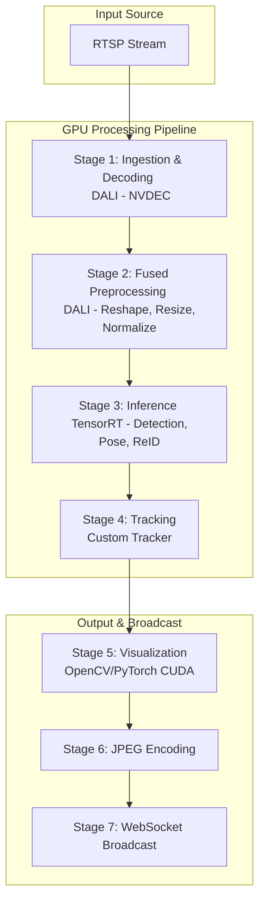

# Noesis Video Analytics Pipeline: A Technical Walkthrough

This document provides a detailed, end-to-end technical walkthrough of the Noesis video analytics pipeline. It explains the journey of a video frame from its source (RTSP stream) to its final output as annotated data broadcast over WebSockets.

## I. High-Level Architecture

The pipeline is designed for high-performance, GPU-accelerated video processing. The core philosophy is **"GPU-only"** [[memory:190837]] to maximize throughput and minimize CPU overhead. It avoids CPU fallbacks [[memory:190780]] and ensures that if a GPU operation fails, the system halts to allow for immediate debugging.

The architecture can be broken down into several key stages:

1.  **Ingestion & Decoding**: Reading the raw video stream and decoding it into processable frames.
2.  **Preprocessing**: Transforming the decoded frames into a format suitable for neural network inference (resizing, normalization, data type conversion).
3.  **Inference**: Running object detection, pose estimation, and re-identification models on the preprocessed frames.
4.  **Tracking**: Associating detections across frames to maintain object identities over time.
5.  **Visualization & Encoding**: Annotating frames with bounding boxes and other metadata, then encoding them for streaming.
6.  **Broadcasting**: Sending the processed data and annotated frames to connected clients via WebSockets.

Here is a high-level ASCII diagram of the pipeline flow:

---

## II. Detailed Stage-by-Stage Breakdown

### Stage 1 & 2: DALI Fused Ingestion & Preprocessing

This is the entry point for video data. Instead of a multi-step process involving separate components for reading, decoding, and preprocessing, the pipeline leverages the **NVIDIA Data Loading Library (DALI)** to create a single, highly optimized, "fused" kernel.

**File:** `dali_video_pipeline.py`
**Class:** `DALIFusedNVDECPipeline`

This approach combines what would traditionally be multiple operations into one continuous operation on the GPU, drastically reducing memory transfers and latency.

#### How it Works:

1.  **`create_optimal_dali_pipeline` (Factory Function)**:
    -   Located in `dali_video_processor.py`.
    -   This function acts as a factory, inspecting the source type (e.g., RTSP URL) and the application configuration.
    -   When it identifies an RTSP stream and a compatible GPU setup, it instantiates the `DALIFusedNVDECPipeline`.

2.  **`DALIFusedNVDECPipeline` (`@pipeline_def`)**:
    -   This class defines the DALI computation graph. The `@pipeline_def` decorator marks the `create_dali_pipeline` method as the graph definition.
    -   **`fn.readers.video`**: This is the core DALI operator for this stage.
        -   **`device="gpu"`**: Instructs DALI to use the GPU for all operations.
        -   **`hw_decoder_load`**: This parameter specifies the load for the hardware decoder (NVDEC). A value around 70% is typical. **[[memory:190831]]**
        -   It directly accepts the RTSP URL, handling both the network stream reception and video decoding using the onboard **NVDEC (NVIDIA Video Decoder)** chip on the GPU. This avoids any CPU involvement in the decoding process.

3.  **Fused Preprocessing Operators**:
    -   Immediately following the video reader within the same DALI pipeline, a series of transformation operators are applied to the decoded frame tensor.
    -   **`fn.reshape`**: Changes the data layout of the frame tensor from HWC (Height, Width, Channels) to CHW (Channels, Height, Width), which is the standard input format for most deep learning models, including those used in this pipeline.
    -   **`fn.resize`**: Resizes the frame to the fixed dimensions required by the TensorRT inference engine (e.g., 640x640). This ensures a consistent input size for the models.
    -   **`fn.normalize`**: Performs mathematical normalization on the pixel values. It changes the pixel value range (typically 0-255 for 8-bit color) to a different range (e.g., 0.0-1.0) and adjusts the values based on a mean and standard deviation. This is crucial for model accuracy, as the models were trained on data with a specific distribution.
    -   **`fn.cast`**: Converts the data type of the tensor to `float16` (half-precision). This is a key optimization for TensorRT, enabling faster computations and lower memory usage with minimal impact on accuracy. **[[memory:190827]]**

**Output of this stage**: A batch of preprocessed `torch.Tensor` objects, residing entirely on the GPU, with `torch.float16` data type and CHW layout, ready for inference.

### Stage 3: TensorRT Inference

With a preprocessed tensor ready, the pipeline moves to the inference stage, where the actual "analytics" happen. This is managed by a dedicated inference manager that uses **NVIDIA TensorRT**.

**Files:** `gpu_pipeline.py`, `tensorrt_inference.py`
**Classes:** `UnifiedGPUPipeline`, `GPUOnlyDetectionManager`

#### How it Works:

1.  **`UnifiedGPUPipeline._pipeline_loop`**:
    -   This is the main control loop that orchestrates the flow from DALI to the final output.
    -   It calls the DALI pipeline's `read_gpu_tensor()` method to get the next batch of preprocessed tensors.
    -   It performs a critical tensor integrity check (`_validate_tensor_integrity`) to ensure the tensor from DALI is not corrupted before passing it to the inference engine.

2.  **`GPUOnlyDetectionManager.process_tensor`**:
    -   This method takes the validated GPU tensor and runs the inference process.
    -   **TensorRT Engine**: It uses a pre-built, optimized TensorRT engine (`.engine` or `.plan` file). TensorRT takes a trained model (from a framework like PyTorch or TensorFlow) and optimizes it for the specific GPU it will run on, applying graph optimizations, layer fusion, and precision calibration.
    -   **Inference Execution**: The manager pushes the input tensor to the GPU, executes the TensorRT engine, and retrieves the output tensors, which contain raw detection data (bounding boxes, confidence scores, class IDs).

3.  **Post-processing**:
    -   The raw output from the TensorRT engine is not yet human-usable. The `_postprocess_detections` method is called to:
        -   Apply a confidence threshold to filter out low-confidence detections.
        -   Perform Non-Maximal Suppression (NMS) to eliminate overlapping bounding boxes for the same object.
    -   **Pose Estimation & Re-identification (ReID)**: If enabled, the pipeline then runs additional models:
        -   **Pose Estimator**: Takes the detected person bounding boxes and runs a pose estimation model to find keypoints (e.g., joints).
        -   **Feature Extractor (ReID)**: For each valid detection, it runs a ReID model to generate a unique feature vector (an "embedding"). This vector acts as a digital fingerprint for the detected object.

**Output of this stage**: A structured set of `Detection` and `Track` objects containing bounding boxes, class labels, confidence scores, keypoints, and ReID feature vectors.

### Stage 4: Tracking

The tracking stage links detections from one frame to the next, assigning a consistent ID to each unique object.

**File:** `tracking.py`
**Class:** `TrackingSystem`

#### How it Works:

-   The `TrackingSystem` receives the detections from the inference stage.
-   It uses a combination of metrics to match current detections with existing tracks:
    -   **IoU (Intersection over Union)**: Measures the overlap between bounding boxes in consecutive frames.
    -   **Feature Vector Comparison**: Compares the ReID feature vectors of current detections with the stored vectors of existing tracks using a distance metric (like cosine similarity). This is very robust for re-identifying an object even after it has been occluded or has left and re-entered the frame.
-   The tracker manages the lifecycle of tracks: creating new ones for new objects, updating existing ones, and marking tracks as "inactive" if an object is lost for a certain period.

**Output of this stage**: A list of `Track` objects, each with a stable ID and a history of its state (position, features).

### Stage 5 & 6: Visualization and Encoding

This stage is responsible for creating a visual representation of the analytics and preparing it for broadcast.

**Files:** `main.py`, `visualization.py`
**Classes:** `ApplicationManager`, `VisualizationManager`

#### How it Works:

1.  **`ApplicationManager._process_analysis_frame`**:
    -   This method in the main application orchestrates the output. It receives an `AnalysisFrame` containing the original frame and all the associated detection and tracking data.
    -   It calls the `VisualizationManager` to draw annotations on the frame.

2.  **`VisualizationManager.annotate_frame`**:
    -   This function takes the raw frame and the tracking data.
    -   Using OpenCV functions (which can be GPU-accelerated with a `GpuMat`), it draws:
        -   Bounding boxes around detected/tracked objects.
        -   Object IDs and class labels.
        -   Keypoints and skeletons from pose estimation.
        -   Movement traces to show the path of an object.

3.  **JPEG Encoding**:
    -   Once the frame is annotated, it is encoded into the JPEG format using `cv2.imencode`. This compresses the frame into a binary format suitable for network transmission.

**Output of this stage**: A binary JPEG image buffer.

### Stage 7: WebSocket Broadcasting

The final stage is to transmit the processed information to all connected clients.

**Files:** `main.py`, `websocket_server.py`
**Classes:** `ApplicationManager`, `WebSocketServer`

#### How it works:

1.  **Binary Message Formatting**:
    -   A custom binary message format is used for efficiency. The message is constructed as follows:
        `[1-byte camera ID length][UTF-8 camera ID][JPEG image data]`
    -   This allows the frontend client to easily parse the message and know which camera stream the frame belongs to.

2.  **`WebSocketServer.broadcast_sync`**:
    -   The `ApplicationManager` calls this method on the `WebSocketServer` instance.
    -   The server iterates through all connected WebSocket clients and sends the binary message to each one.

3.  **Frontend Reception (`renderer.js`)**:
    -   The Electron frontend has a WebSocket client that listens for incoming messages.
    -   The `processBinaryFrame` JavaScript function is triggered on message receipt.
    -   It parses the binary message according to the custom format, extracts the camera ID and the JPEG data, and then creates a `Blob` which is rendered as an image in the UI.

This concludes the journey of a single video frame through the Noesis pipeline. Each step is carefully designed and optimized to leverage GPU capabilities for maximum performance. 