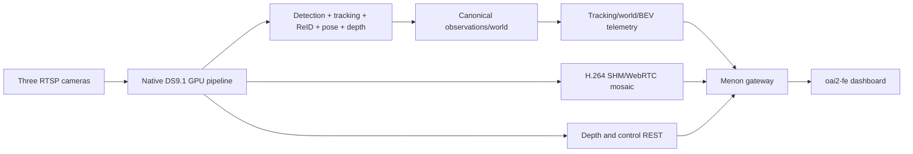

# High-level application flow

```mermaid
flowchart LR
    A[Three RTSP cameras] --> B[Native DS9.1 GPU pipeline]
    B --> C[Detection + tracking + ReID + pose + depth]
    C --> D[Canonical observations/world]
    D --> E[Tracking/world/BEV telemetry]
    B --> F[H.264 SHM/WebRTC mosaic]
    B --> G[Depth and control REST]
    E --> H[Menon gateway]
    F --> H
    G --> H
    H --> I[oai2-fe dashboard]
```

The application has no Docker or legacy-runtime hop. Noesis ports are
loopback-only; Menon owns browser authentication and delivery.
