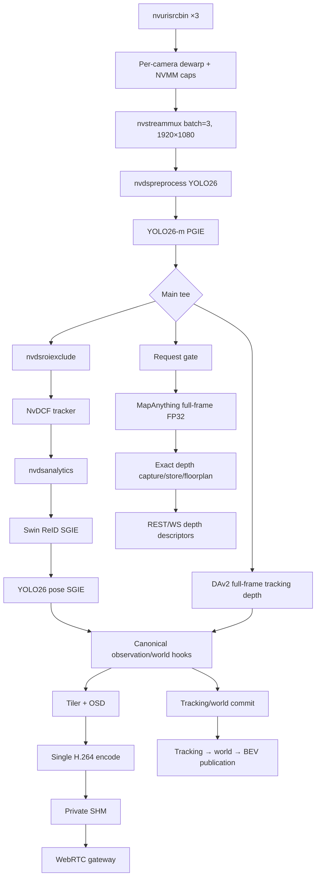

# Low-level perception and publication flow

```mermaid
flowchart TB
    SRC[nvurisrcbin ×3] --> DEW[Per-camera dewarp + NVMM caps]
    DEW --> MUX[nvstreammux batch=3, 1920×1080]
    MUX --> PRE[nvdspreprocess YOLO26]
    PRE --> PGIE[YOLO26-m PGIE]
    PGIE --> TEE{Main tee}

    TEE --> ROI[nvdsroiexclude]
    ROI --> TRK[NvDCF tracker]
    TRK --> ANA[nvdsanalytics]
    ANA --> REID[Swin ReID SGIE]
    REID --> POSE[YOLO26 pose SGIE]
    POSE --> OBS[Canonical observation/world hooks]
    OBS --> TILER[Tiler + OSD]
    TILER --> ENC[Single H.264 encode]
    ENC --> SHM[Private SHM]
    SHM --> WEBRTC[WebRTC gateway]

    TEE --> DAV2[DAv2 full-frame tracking depth]
    DAV2 --> OBS
    TEE --> VALVE[Request gate]
    VALVE --> MA[MapAnything full-frame FP32]
    MA --> DEPTH[Exact depth capture/store/floorplan]

    OBS --> COMMIT[Tracking/world commit]
    COMMIT --> WS[Tracking → world → BEV publication]
    DEPTH --> REST[REST/WS depth descriptors]
```

All core video stages stay on GPU/NVMM. CPU work is restricted to explicit
metadata, serialization, persistence, and dashboard boundaries.
