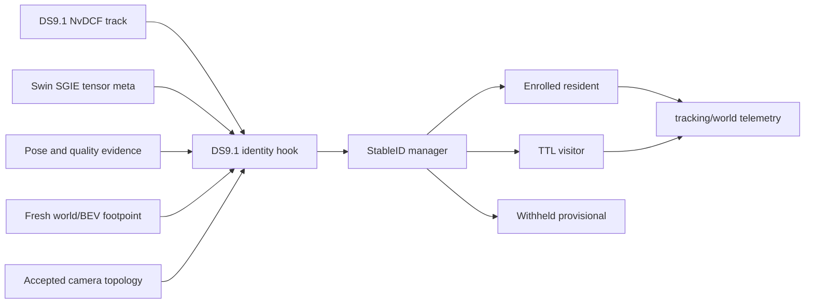

# Household identity

Status: application implementation is present in the native DeepStream 9.1
baseline. Final authority still depends on the qualifying household evidence
listed in `work_order.md` and `validation.md`.

The goal is a closed-world household identity system: a small enrolled resident
set, bounded visitor identities, geometry-aware multi-camera association, and
quality-gated Swin embeddings without CPU-frame extraction.

## Current data flow

The only prospective co-visibility edge is Kitchen ↔ Family Room and it remains
disabled until the geometry and synchronized overlap evidence are accepted.
Living Room ↔ Family Room do not overlap. Kitchen ↔ Living Room are adjacent,
not overlapping.

## Current implementation

- `reid/stable_id_manager.py` owns identity assignment, resident/visitor state,
  assignment constraints, and gallery policy.
- `DS9/noesis/ds9_runtime_core.py` constructs the process-owned manager.
- `DS9/noesis/pipelines/hooks.py` joins tracker, ReID, pose, and world evidence.
- `noesis/server/reid_api.py` exposes enrollment and alias operations.
- `DS9/pipelines/config_infer_secondary_reid_swin.ini` is the selected ReID
  SGIE; `DS9/config/infer.yaml` selects it.

MV3DT is not part of the active identity path. Older DS8 implementation phase
documents are retained under
`plans/archive/completed/household_identity_ds8_implementation/` only to explain
how the current contracts evolved.

## Active records

| File | Role |
| --- | --- |
| `work_order.md` | Remaining acceptance and optional work |
| `decisions.md` | Identity-specific design decisions |
| `contracts.md` | Identity fields and lifecycle contracts |
| `camera_topology.md` | Overlap/exclusivity authority |
| `calibration_and_enrollment.md` | Evidence, calibration, and enrollment gates |
| `performance.md` | Embedding and latency budgets |
| `validation.md` | Focused and household acceptance checks |

## Acceptance target

- resident identity count stays within the enrolled household;
- visitor identities remain bounded and recycle by policy;
- no false same-identity sharing across non-overlapping cameras;
- accepted overlap co-visibility preserves one identity;
- resident handoff recall exceeds the recorded target in `validation.md`;
- no material regression to the accepted three-camera FPS/latency baseline.
