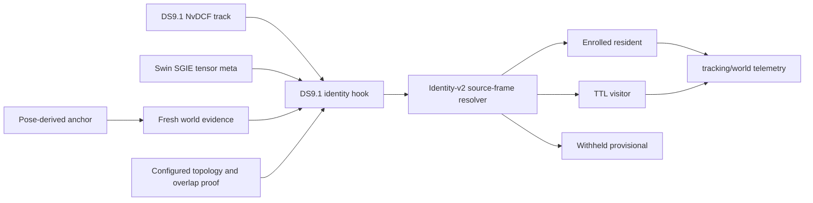

# Household identity

Status: application implementation is present in the native DeepStream 9.1
baseline. Final authority still depends on the qualifying household evidence
listed in `work_order.md` and `validation.md`.

The goal is a closed-world household identity system: a small enrolled resident
set, bounded visitor identities, geometry-aware multi-camera association, and
quality-gated Swin embeddings without CPU-frame extraction.

## Identity-v2 authority contract

This diagram describes the authoritative identity-v2 lane. The configured mode
and admitted authority artifacts determine whether it owns live public output.

```mermaid
flowchart LR
    TRACK[DS9.1 NvDCF track] --> JOIN[DS9.1 identity hook]
    REID[Swin SGIE tensor meta] --> JOIN
    POSE[Pose-derived anchor] --> WORLD[Fresh world evidence]
    WORLD --> JOIN
    TOPO[Configured topology and overlap proof] --> JOIN
    JOIN --> RESOLVE[Identity-v2 source-frame resolver]
    RESOLVE --> RESIDENT[Enrolled resident]
    RESOLVE --> VISITOR[TTL visitor]
    RESOLVE --> PROVISIONAL[Withheld provisional]
    RESIDENT --> WIRE[tracking/world telemetry]
    VISITOR --> WIRE
```

The [checked-in topology](../../config/camera_topology.yaml) enables a
conditional Kitchen ↔ Family Room identity-overlap pair. A permit still requires
the current geometry, timestamps, and appearance evidence specified by the
[topology contract](camera_topology.md); configuration alone does not satisfy
the remaining authority-acceptance gates or prove live activation. Living Room
↔ Family Room do not overlap. Kitchen ↔ Living Room are adjacent, not overlapping.

## Current implementation

- `reid/stable_id_manager.py` retains the legacy assignment and gallery lane.
- `noesis/identity_v2_service.py` owns the identity-v2 source-frame resolver and
  public overlays when authoritative mode is selected and admitted.
- `DS9/noesis/ds9_runtime_core.py` constructs the process-owned identity services.
- `DS9/noesis/pipelines/hooks.py` joins tracker, ReID, pose, and world evidence.
- `noesis/server/reid_api.py` exposes enrollment and alias operations.
- `DS9/pipelines/config_infer_secondary_reid_swin.ini` is the selected ReID
  SGIE; `DS9/config/infer.yaml` selects it.

Identity topology does not enable MV3DT; its accepted Kitchen/Family Room
tracking lane remains a separate explicit runtime opt-in. Older DS8
implementation phase documents are retained under
`plans/archive/completed/household_identity_ds8_implementation/` only to explain
how the current contracts evolved.

## Active records

| File | Role |
| --- | --- |
| `work_order.md` | Remaining acceptance and optional work |
| `decisions.md` | Identity-specific design decisions |
| `contracts.md` | Identity fields and lifecycle contracts |
| `camera_topology.md` | Overlap/exclusivity authority |
| `calibration_and_enrollment.md` | Evidence, calibration, and enrollment gates |
| `performance.md` | Embedding and latency budgets |
| `validation.md` | Focused and household acceptance checks |

## Acceptance target

- resident identity count stays within the enrolled household;
- visitor identities remain bounded and recycle by policy;
- no false same-identity sharing across non-overlapping cameras;
- accepted overlap co-visibility preserves one identity;
- resident handoff recall exceeds the recorded target in `validation.md`;
- no material regression to the accepted three-camera FPS/latency baseline.
